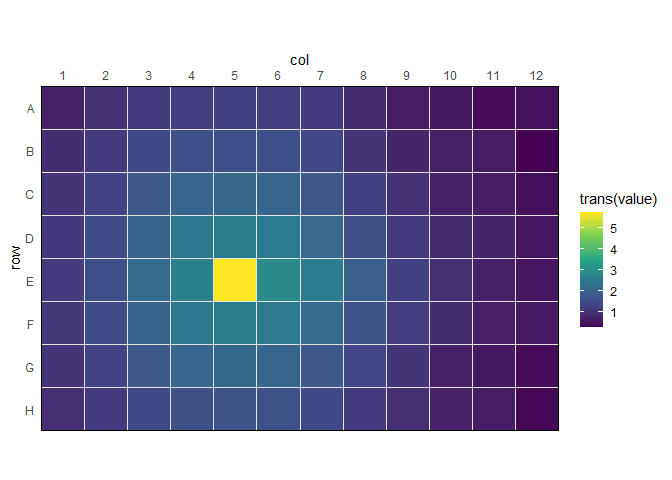
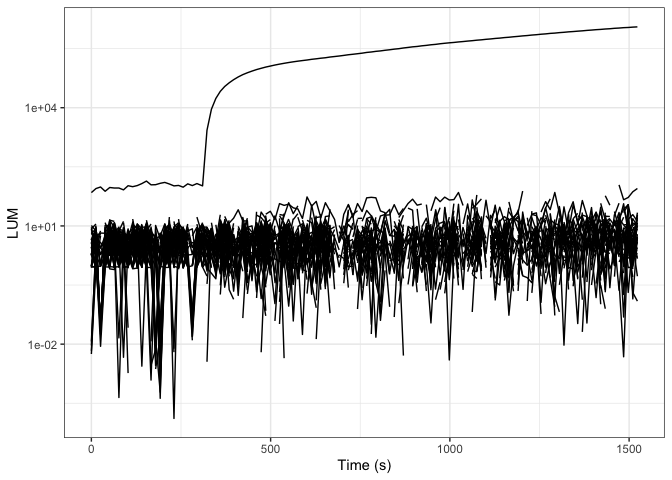
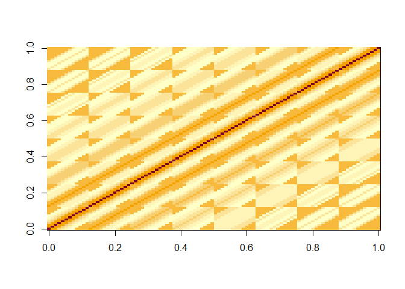

<!-- README.md is generated from README.Rmd. Please edit that file -->

# reluxr

<!-- badges: start -->

[](https://github.com/BradyAJohnston/reluxr/actions/workflows/R-CMD-check.yaml)
[](https://CRAN.R-project.org/package=reluxr)
[](https://lifecycle.r-lib.org/articles/stages.html#experimental)

<!-- badges: end -->

The goal of `{reluxr}` is to enable deconvolution of luminescencent
plate-based experiments. The implementation is based on the MatLab
implementation from the paper titled **1Deconvolution of Luminescence
Cross-Talk in High-Throughput Gene Expression Profiling’ Mauri,
Vecchione, and Fritz (2019)**

## Installation

You can install the development version of reluxr from
[GitHub](https://github.com/) with:

``` r
install.package("reluxr", repos = "https://bradyajohnston.r-universe.dev")
```

## Example

This is a basic example which shows you how to solve a common problem:

``` r
library(reluxr)
library(dplyr)
#> 
#> Attaching package: 'dplyr'
#> The following objects are masked from 'package:stats':
#> 
#>     filter, lag
#> The following objects are masked from 'package:base':
#> 
#>     intersect, setdiff, setequal, union
library(ggplot2)

fl <- system.file(
   "extdata",
   "calibrate_tecan",
   "calTecan1.xlsx",
   package = "reluxr"
 )
```

## Create a Deconvolution Matrix

``` r
dat <- plate_read_tecan(fl)

dat
#> # A tibble: 23,040 × 5
#>    cycle_nr time_s signal well   value
#>       <dbl>  <dbl> <chr>  <chr>  <dbl>
#>  1        1      0 OD600  A01   0.0450
#>  2        1      0 OD600  A02   0.0452
#>  3        1      0 OD600  A03   0.0453
#>  4        1      0 OD600  A04   0.0453
#>  5        1      0 OD600  A05   0.0453
#>  6        1      0 OD600  A06   0.0452
#>  7        1      0 OD600  A07   0.0458
#>  8        1      0 OD600  A08   0.0456
#>  9        1      0 OD600  A09   0.0455
#> 10        1      0 OD600  A10   0.0451
#> # … with 23,030 more rows

mat_d_best <- dat |>
  filter(signal != "OD600") |> 
  filter(time_s > 500) |> 
  rl_calc_decon_matrix(value, time_s, ref_well = "E05", b_noise = 30)

image(log10(mat_d_best))
```


Plot the values.

``` r
rl_plot_time <- function(data, time, value, group = "well") {
  
  data <- dplyr::mutate(
    data, 
    time = {{ time }}, 
    value = {{ value }}, 
    group = {{ group }}
  )
  
  plt <- ggplot2::ggplot(
    data, 
    mapping = ggplot2::aes(
      x = time,
      y = value, 
      group = group
    )
  ) + 
    ggplot2::geom_line() + 
    ggplot2::scale_y_log10() + 
    ggplot2::theme_bw()
  
  plt
}
```

``` r
dat |>
  ungroup() |> 
  filter(signal == "LUMI") |> 
  rl_plot_time(time_s, value, well) + 
  labs(
    x = "Time (s)", 
    y = "LUM"
  )
#> Warning in self$trans$transform(x): NaNs produced
#> Warning: Transformation introduced infinite values in continuous y-axis
#> Warning: Removed 25 rows containing missing values (`geom_line()`).
```



``` r
dat |>
  ungroup() |> 
  filter(signal == "LUMI") |> 
  rl_adjust_plate(value, mat_d_best, time = time_s) |>
  rl_plot_time(time_s, value, well) + 
  labs(
    x = "Time (s)", 
    y = "LUM"
  )
#> Warning in self$trans$transform(x): NaNs produced
#> Warning: Transformation introduced infinite values in continuous y-axis
#> Warning: Removed 639 rows containing missing values (`geom_line()`).
```



``` r

fl <- system.file(
  "extdata",
  "calibrate_tecan",
  "calTecan1.xlsx",
  package = "reluxr"
)

dat <- plate_read_tecan(fl)

mat_d_best <- dat |>
  filter(signal != "OD600") |>
  filter(time_s > 500) |>
  rl_calc_decon_matrix("value", "time_s", ref_well = "E05", b_noise = 30)

dat |>
  ungroup() |>
  summarise(value = mean(value), .by = well) |>
  rl_plot_plate(value, trans = log10) +
  scale_fill_viridis_c(
    limits = c(1, NA)
  )
#> Scale for fill is already present.
#> Adding another scale for fill, which will replace the existing scale.
```



``` r

dat |>
  ungroup() |>
  filter(signal == "LUMI") |>
  rl_adjust_plate(value, mat_d_best, time = time_s) |>
  summarise(value = mean(value), .by = well) |>
  rl_plot_plate(value, trans = log10) +
  scale_fill_viridis_c(
    limits = c(1, NA)
  )
#> Scale for fill is already present.
#> Adding another scale for fill, which will replace the existing scale.
#> Warning in FUN(X[[i]], ...): NaNs produced
```


<div id="refs" class="references csl-bib-body hanging-indent">

<div id="ref-mauri2019" class="csl-entry">

Mauri, Marco, Stefano Vecchione, and Georg Fritz. 2019. “Deconvolution
of Luminescence Cross-Talk in High-Throughput Gene Expression
Profiling.” *ACS Synthetic Biology* 8 (6): 1361–70.
<https://doi.org/10.1021/acssynbio.9b00032>.

</div>

</div>
